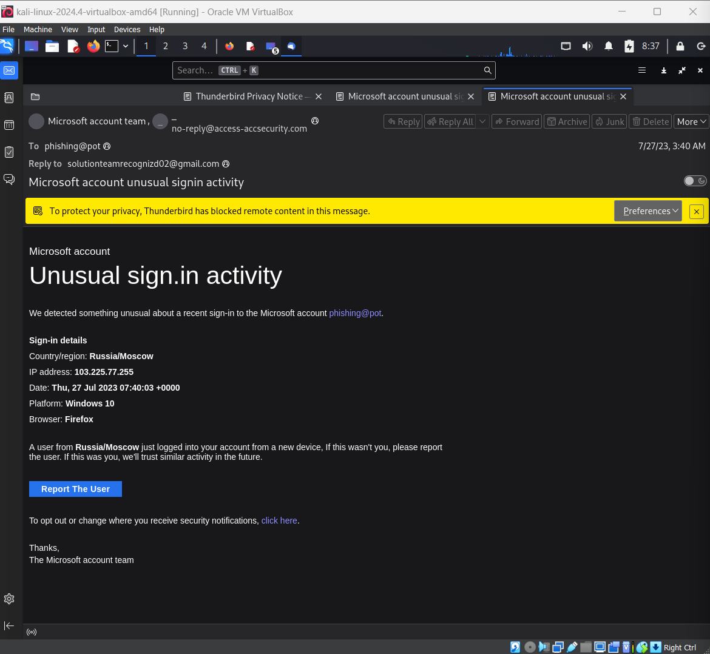
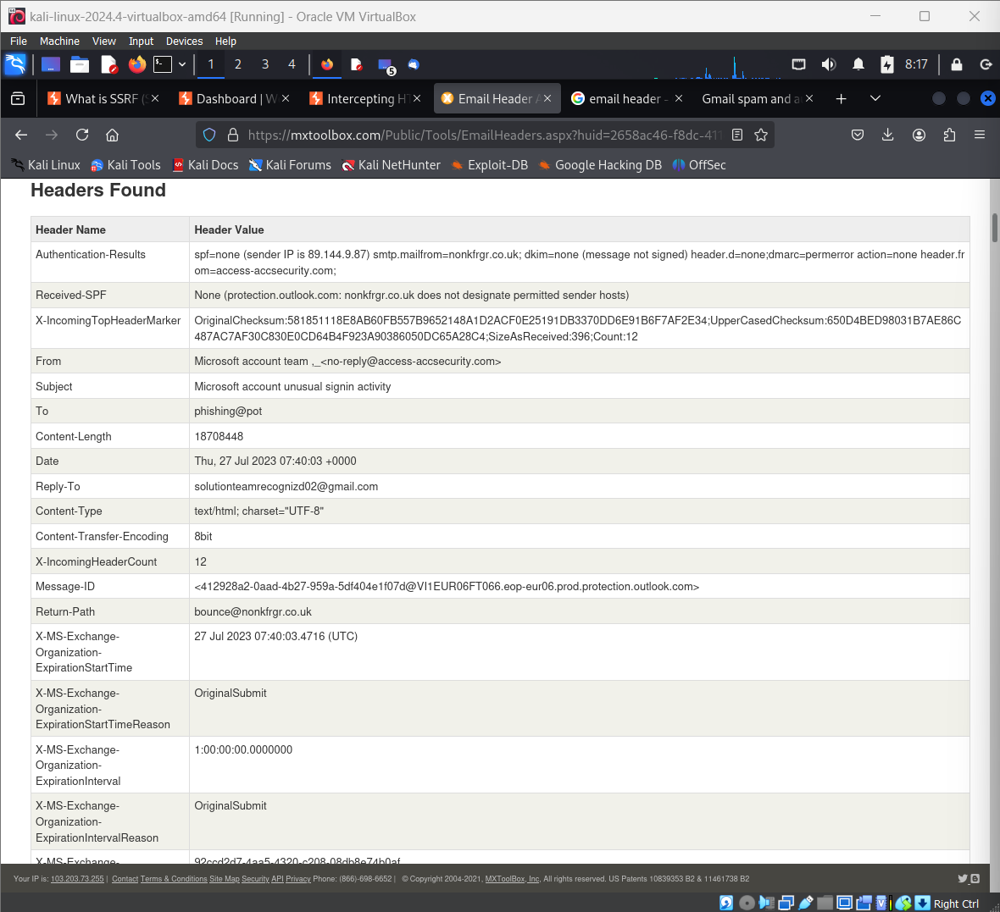

# CyberSecurity_Internship-Elevate_labs-task2
# Phishing Email Analysis Report

## Basic Information

| Field           | Value          |
|-----------------|---------------|
| **File Name**   | sample-1011.eml |
| **Date Analyzed** | 2025-08-05   |

## Summary of Steps Taken

Downloaded a sample phishing email (.eml file) from an Open-source GitHub.

Opened the email using Thunderbird on Kali Linux.

Copied the email header from Thunderbird.

Analyzed the header using MXToolbox Header Analyzer. 

## Header Analysis

| Field            | Details                                               |
|------------------|------------------------------------------------------|
| **From**         | Microsoft account team <no-reply@access-accsecurity.com> |
| **Reply-To**     | solutionteamrecognized02@gmail.com                               |
| **Return Path**  | bounce@nonkfrgr.co.uk                            |
| **Sender IP**    | 89.144.44.2                                          |
| **SPF**          | None                                              |
| **DKIM/DMARC**   | Not configured                                       |
| **Subject**      | Microsoft account unusual signin activity            |
| **Date**         | Thu, 27 Jull 2023 07:40:03 +0000                       |

### Header Findings

- **Sender domain mismatch:** The "From" address claims to be Microsoft but uses a suspicious domain (`access-accsecurity.com`).
- **Return Path and Reply-To:** Both use unrelated domains (`nonkfrgr.co.uk`, `gmail.com`), indicating likely spoofing.
- **SPF Failure & DMARC Not Configured:** The email lacks proper authentication, a common phishing trait.
- **High Priority Flag:** Set to invoke urgency.

---

### Screenshots

## Received Mail

## Generated report by MXtoolbox header analyzer

---

## Phishing Indicators Identified

| Indicator Type             | Description                                                                                          |
|----------------------------|------------------------------------------------------------------------------------------------------|
| **Spoofed Email Address**  | Appears to be Microsoft, but the domain is fake (`access-accsecurity.com`).                         |
| **Fake Reply Address**     | Replies are sent to a Gmail account (`solutionteamrecognized02@gmail.com`)                          |
| **Threatening/Urgent Language** | Uses urgent language: “If this wasn't you, please report the user"                             |                            
| **Mismatch in Message & Links** | Appears to be a login alert, but links open an email composer instead of a Microsoft page.      |
| **Grammar Errors**         | Phrases like "sign.in activity", inconsistent spacing/punctuation.                                   |
| **Unfamiliar IP/Location** | Claims a login from “Russia/Moscow” using `103.225.77.255` to induce fear.                          |
| **No Official Branding**   | No digital signature, official footer, or policy links.                                             |

---

##  Conclusion

This email contains multiple classic phishing indicators, including:

- Spoofed sender and reply addresses
- Urgent and manipulative language
- Suspicious links and tracking pixels
- Authentication failures (SPF/DKIM/DMARC)
- Grammar errors, and lack of branding

**Recommendation:**  
Do not interact with the similar mail. Mark it as phishing and report it to your IT/security team. Use this analysis as a reference for identifying similar threats in the future.

---
